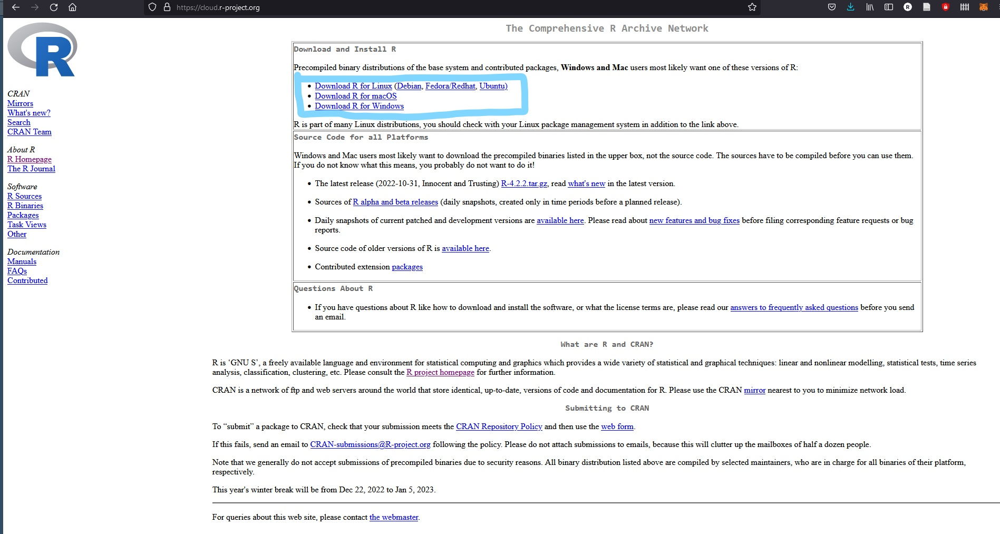
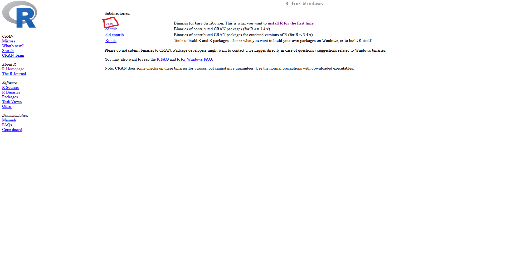
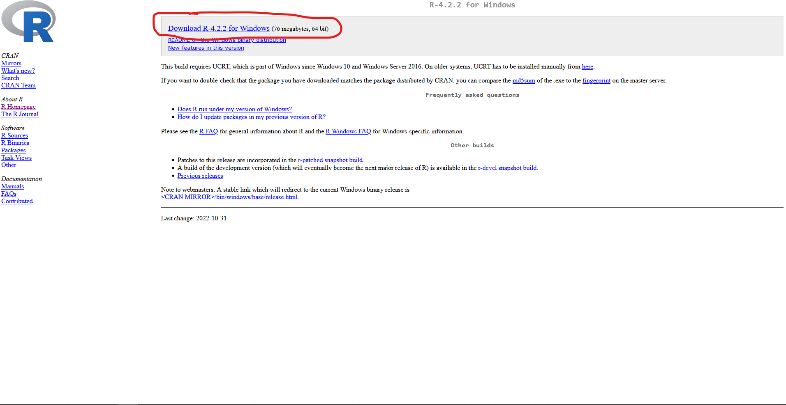
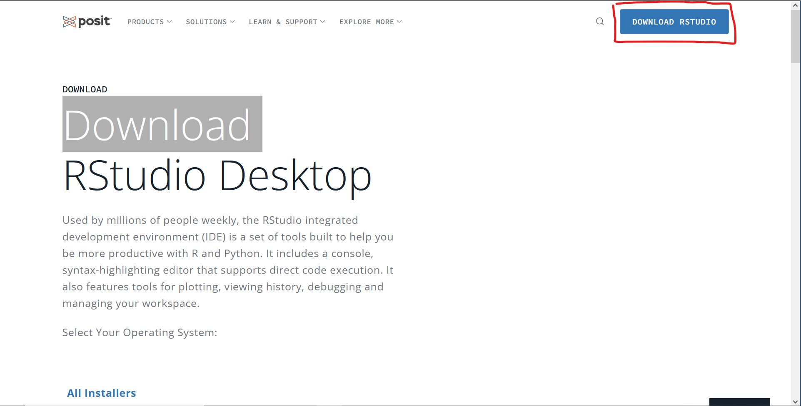
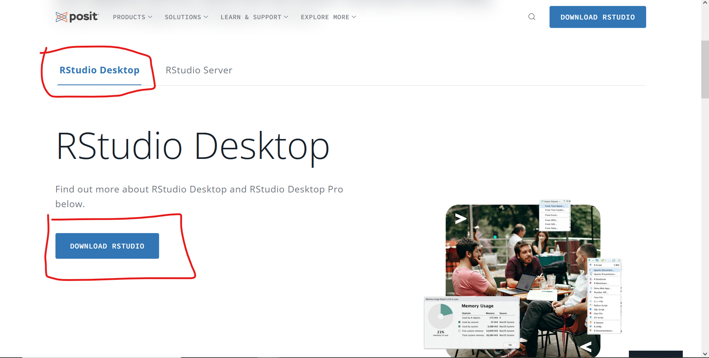
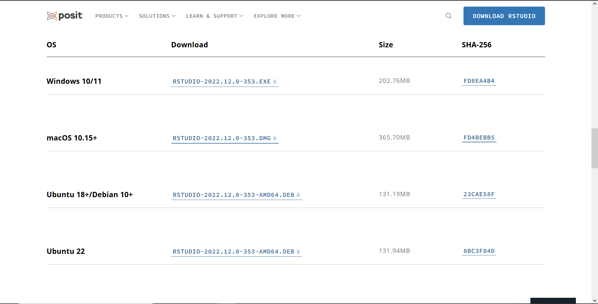
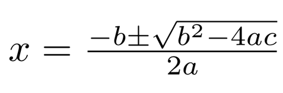

```{r setup, include=FALSE}
knitr::opts_chunk$set(echo = TRUE)
pkgs <- c("tidyverse")
invisible(lapply(pkgs, library, character.only = T))
```

# Introduction

 <br/>
Welcome to the 2023 #DegreesNYC R Course! As you know, #DegreesNYC is on a mission to radically transform the NYC public school system at all levels. Collective impact and youth engagement are pillars of #DegreesNYC's mission and are the primary tools that the organization uses to further its goals. The folks at #DegreesNYC, however, are aware that the policy space in which they exist values quantitative evidence highly. This course is meant to democratize quantitative expertise, by giving you an introduction to some of the skills you will need to find, manipulate, and analyze data using R. Our hope is that this will not only be enriching for you personally, but will better position you to make policy arguments in the future.

During the course you are going to work primarily in R and much of the work done using R will be done with R Markdown. Don't worry if you are not familiar with the language or with coding at all; this class and the Codecademy course that will supplement it are meant for beginners. If you do have experience with R and feel that the course is moving too slowly or that you are not being sufficiently challenged here are some options: 1) Add complexity to the examples and challenges presented in class or on Codecademy, 2) read ahead in the syllabus and work on something that is at your level, or 3) focus extra time on your project. Though there are many other languages used for data analysis (including Python, SAS, Stata, and SQL), you will not explore those. If you'd like to know more about one of them feel free to reach out to me and I am happy to share what I know or help point you to a starting place if I am inexperienced in the language myself. 

## Contact

Feel free to email me at any time at regg19970@gmail.com.

## About the instructor

Reggie Gilliard came to data analytics and R through an unusual path. He started his career as a teacher in private schools, first at San Francisco Day school and then at Collegiate. Education is now and has always been important to him, but feeling that his impact could be greater outside of the classroom he set off to pursue a master's degree in education policy.

That degree led Reggie to the Research Alliance for New York City Schools, where his relationship with #DegreesNYC began. That position led him to a PhD at Teachers College, Columbia University in the Economics and Education program. Currently, he is a Data Analytics Developer at [Mathematica](https://www.mathematica.org/). He has experience using SAS, SQL, Stata, R, and Python (as well as tools like Excel), but is most well versed in R and Stata.

Outside of the work he does he enjoys reading; playing sports, video games, and board games; trying new restaurants, and generally spending time with his friends and family.

```{r instructor_pic, out.height = "400px", echo = F}
knitr::include_graphics("./Introduction/instructor.jpg")
```

## Plan for the course  {.tabset .tabset-fade .tabset-pills}

The course will be split into two units. Unit 1 - Learning and Unit 2 - Project. 

### Learning

During the Learning Unit you will be focused on working through lessons. Each session will be split into two parts: 1) a fifteen minute mini-lesson delivered by me or another member of the #DegreesNYC team, 2) a Codecademy lesson. The mini-lessons are designed to align as closely as possible with the Codecademy lesson for the week to provide as much reinforcement and clarification on the topics that you will cover as possible.

### Project

Unit 2 will be dedicated to a complete analysis of a data set of your choice. For the final six weeks of the course, finishing this project will be the goal. We may still cover some topics briefly to give you additional tools which are beyond the scope of the lessons, but are useful for creating an appealing report, however most of the time will be spent in breakout groups working on your projects. All projects will be undertaken individually, but teams of two will be permitted if there is a compelling reason. 

To complete the project you will need to take your data set through the following stages:

* Research Question Creation

  + Brainstorm some questions that you are curious about and want to spend some time exploring. Many of you are students or are already working in the research field; if it is helpful, bring questions that are relevant for your work or your classes.

* Data Identification

  + Identify a data set that can be used to address the question that you are interested in. If you have access to a data set that you want to examine, you are encouraged to do that (**Note: think carefully about privacy concerns. If you are the only one who should be seeing the data, you may want to create a mock data set that your classmates and I can view so that we can support your project work**). If you don't have access to a data set there are many places that you can go to find a data set to use:
  
  + [NYC Open Data](https://opendata.cityofnewyork.us/) - New York City focused data sets.
  + [Data.gov](https://data.gov/) - U.S. data sets.
  + [IPEDS](https://nces.ed.gov/ipeds/use-the-data) - Postsecondary education data sets.
  + [NCES](https://nces.ed.gov/ccd/schoolsearch/) - National (or state specific) school data sets.
  + [Kaggle](https://www.kaggle.com/datasets) - Public data sets on a wide variety of topics (account needed).

* Data cleaning
  
  + Use the tools you have learned in the class to clean the data that you've downloaded. Some considerations:
  
    - Are the variable names easy to work with?
    - Is the data tidy (i.e. is every column one variable, every row one observation, and every cell a single value?)
    - Are the variables that you need available in the data set? If not, can you create them?
    - Are the variables the correct type?

* Data Analysis

  + Provide some basic descriptive statistics on the data set. Use measures such as the mean, median, min, max, or other statistics to describe variables of interest in your data set.
  + If you would like to go beyond standard descriptive analysis, consider using what you learn about ANOVAs on Codecademy to test for significant differences between levels of a categorical variable of interest.

* Data Visualization

  + Once you have cleaned and analyzed your data, it will be time to visualize your results. `ggplot2` is the package that we will use for visualization in this class and the possibilities are broad. The [ggplot2 gallery](https://r-graph-gallery.com/) shows the wide range of graphs that you can create using `ggplot2` and related packages, and even provides code to use to get started. 
  + R Markdown renders the data sets that you create, but it isn't particularly nice. It is possible to create publication-ready tables using the kable and kableExtra packages. If your analysis includes substantial statistical reporting, use these packages to show your tables to the reader.
  + If you want to challenge yourself, try turning your R Markdown document into an interactive Shiny Dashboard!
  
I encourage you to use the time in break out rooms collaboratively: share your screens, share code, ask each other questions, and learn from one another. Use your classmates and me as a resource to create something you feel is worthwhile. Although I suggest doing the project alone, this is to maximize learning, not to prevent "cheating". Any and all collaboration is welcome in this course.

## Syllabus

This syllabus will be the repository for everything course-related. Information about lessons, the project, and enrichment is all contained here. The table of contents in the top left has links to the content for Units 1 and 2, the introduction, and enrichment activities. Within the Unit 1 header there are tabs for each of the 6 lessons that you will work through during our time together. These lessons each also have tabs for the topics you will cover, the lesson itself, and any helpful links that you might want to explore. This document will be hosted publicly on GitHub, but it is a living document. If anything changes or if there are problems with the URL leading to the syllabus, I will let you know as soon as possible.

# Unit 1 - Learn R {.tabset .tabset-fade .tabset-dropdown}

## Lesson 1 - An introduction to R (what, why, how) {.tabset .tabset-fade .tabset-pills}

### **Topics Covered**

1. What is R?
2. Why use R?
3. How do I install R?
4. The tools of the class.

### **Lesson**

#### **What is R?**

- Fully realized programming language including loops, conditionals, user-defined functions, and several object-oriented systems.
- Strong data storage, manipulation, and visualization capabilities.
- Suite of statistical packages and built-in functions.

#### **Why use R?**


R is one of the most common languages for data science and data analysis. This is because, with experience, one can take a project from beginning to end only using R. You can download data; manipulate it by creating new variables, dropping missing observations, etc.; perform statistical analysis; and visualize and output results. R, like Stata and SAS, has built-in statistical analysis functionality, but unlike those two languages it is 100% free and open source. There is are a wide range of functions in base R, but the R community is very strong and has built a host of tools that make doing data analysis and visualization much easier than it is in base R (you will be working with one such suite of tools, the tidyverse/dplyr, in this class). If you are hoping to get a job doing analytic work, if you want advanced education in a social science field, if you want an introduction to coding/computer science, or if you are just looking to better understand quantitative analysis, R is a good place to begin.

#### **How do I install R?**

To install R you will need about 500mb of free space on your computer (you may actually need less, but freeing up 500 mb ensures you will be able to download the data and packages used in the course). Perform the following series of steps:

1. Go to [The Comprehensive R Archive Network](https://cloud.r-project.org/)

2. Click the link to download R for your operating system


3. Select base


4. Select the download link at the top of the screen.


You should also install R Studio. Here is how you can do that:

1. [Visit posit.co](https://posit.co/download/rstudio-desktop/)

2. Click the download button in the upper right hand corner


3. Scroll down and select RStudio Desktop. Select download RStudio.



4. Scroll down and select the appropriate installation for your operating system.


#### **Class tools**

As noted in the introduction, this class will use Codecademy to aid in learning basic coding skills in R and the basic R workflow. You will need a Codecademy account to retain your progress between sessions. You can register for one [here](https://www.codecademy.com/)
<!-- Should I add in Git here? -->
Another tool you will use throughout the class and one you will also be using in your Codecademy work is a suite of R packages called the Tidyverse. The Tidyverse is designed to make working with data easier and is commonly used in many organizations (we use it at Mathematica, for example). There are eight major packages in the Tidyverse as well as many other specialized packages, but the following are important for this class:

1. ggplot2 - For visualizing data (i.e. creating graphs, and charts).
2. dplyr - For cleaning data and provides access to the magrittr pipe (`%>%`) which you can make use of for many of your data cleaning tasks in this class (although R now has a built-in pipe: `|>`).
3. readr - For reading data sets with simple syntax.

To install the Tidyverse, open R or RStudio and type `install.packages("tidyverse")` into the console.

Finally, you will use R Markdown when creating your projects. R Markdown allows you to write code and text into the same document and have it rendered nicely as a word document, PDF, or html file. I used R Markdown to write this syllabus. Using R Markdown makes integrating visualizations, code, and analyses into your reports simple.

That's it. You're all set up!

#### **Getting help in R**

While you are in class you can ask me questions and, of course, feel free to email me and other members of the #DegreesNYC team as you need support, but there are other things you can do to get answers before asking me or a classmate for help.

1. If you are ever unsure what a function does you can type `?functionname` or `help(functionname)` into the console and a help file will pop up (in the bottom right corner of your screen if you are using R Studio) that has useful information about the function.

```{r l1_e_ex1, eval=FALSE}
?paste
```

2. If you are curious about an entire package you can type vignette(packagename) for more information about the package. Note that not all packages have a vignette.

```{r l1_e_ex2, eval=FALSE}
vignette("dplyr")
```

3. If you need help resolving a more complex problem, try Google or another search engine first. There are many people working in R and many sites which aggregate responses to frequently asked questions. [Stackoverflow](https://stackoverflow.com/) is one that is well-known in the coding community and that I personally use regularly while at work. It is helpful to investigate solutions to your issues yourself first, because you will retain more information when you've had to spend some time searching and iterating on your own.

#### **Install the Course's exercises**

Once you've installed R and set up R studio, open R studio, open a new script, and copy and paste the code below to install the exercises that accompany this course.

```{r install_exercises, eval = F}
# Try to install the swirl package
try(install.packages("swirl", repos = "https://cloud.r-project.org/"))

# Uninstall the DegreesNYC_RCourse
try(swirl::uninstall_course("DegreesNYC_RCourse"), silent = T)

# Install the DegreesNYC_RCourse
try(swirl::install_course_github("R-Gilliard-Jr", "DegreesNYC_RCourse", branch = "main"))
```

### **Helpful Links**

* [Codecademy](https://www.codecademy.com/login)
* [Why use R](https://www.youtube.com/watch?v=9kYUGMg_14s)
* [Familiarize yourself with R](https://www.w3schools.com/r/default.asp)

## Lesson 2 - Variables, data types, and operators {.tabset .tabset-fade .tabset-pills}

### **Topics Covered**

1. What are variables and why are they useful?
2. Assigning variables in R (=, <-, ->)
3. Data types
    + The six basic data types.
    + Character, numeric, and logical: the three most common types.
4. Mathematical operators
5. Logical operators

### **Lesson**

#### **Printing output**

There are many ways to output values in R so that you can see them. One of the easiest is just typing the value into the console.

```{r l2_a_ex1}
4
"Hello"
```

Another way that is often used is to wrap the item you want to show in the `print()` function.

```{r l2_a_ex2}
print(4)
print("Hello")
```

#### **An introduction to variables**

Variables in R are convenient ways to keep track of values. There are times when you will want to perform an operation, save the value, perform some intermediate steps, and then use the original value that you saved. Let's work with the example of addition. You could do the following to add 4 twice:

```{r l2_b_ex1}
4 + 4
```

This is perfectly fine. But you could also use variables to add 4 twice like this:

```{r l2_b_ex2}
x <- 4
x + x
```

Variables allow you to work with values dynamically and without the struggle of trying to remember all of the values that you are working with individually. Keeping the math theme, suppose you wanted to implement the quadratic formula which is written:<br/>
<br/>

And you are provided the following values:

* a = 2
* b = 4
* c = 2

You could do this directly with numbers, as in

```{r l2_b_ex3}
(-4 + sqrt(4^2 - 4*2*2))/(2*2)
```

Or it could be done using variables, as in

```{r l2_b_ex4}
a = 2
b = 4
2 -> c
(-b + sqrt(b^2 - 4*a*c))/(2*a)
```
The advantage of the second option is that if the numbers you would like to enter into formula change, all you have to do is change them once, when assigning them, and you can use the formula again. In the first case, you would need to go through and make sure you've got all of the numbers entered into their correct locations carefully. The true power of variables will not be seen until you begin to work with for loops, but, for now, think of them as useful ways to store information.

#### **Assigning variables in R**

In the examples above I created four different variables: x, a, b, and c. I assigned values to those variables in three different ways: <-, =, ->. You can use any of these assignment operators to assign a value to a variable. To assign a value with the equal sign or the left-arrow the variable name should go the left-hand side of the operator and the value that you want to assign should be on the right-hand side.

```{r l2_c_ex1}
x <- 2
print(paste("x equals:", x))
y = 2023
print(paste("y equals:", y))
```

There is also the right-arrow operator. If using this to assign a value to a variable, the value should be on the left-hand side and the name of the variable should be on the right-hand side.

```{r l2_c_ex2}
"Hello" -> z
print(paste("z equals:", z))
```

There is nothing wrong with using any of the assignment operators so you should go with the one you are most comfortable with, especially as you learn. The industry standard, however, is to use the left-arrow unless there is good reason. This prevents confusion when you are trying to do a check for equality (`==`) and may be easier to read than the right-arrow. I will use the left-arrow exclusively throughout the remainder of this course.

#### **Basic data types**

There are 6 basic data types:

1. Logical
    + True/false data type (Boolean).
2. Numeric
    + All real numbers.
3. Integer
    + Real values without decimal points.
4. Complex
    + Imaginary values
5. Character
    + String values. These are values that can contain non-numeric characters (such as letters).
6. Raw
    + Specifies values as raw bytes
  
In this class you will focus on the logical, numeric, and character data types. These are the three most common types. See the helpful links for more information about the types that you will not cover.

##### **Logical**

Data with class logical can only take on the values of true or false. Another name for this type of data is Boolean. In R, `TRUE` and `FALSE` are equivalent to 1 and 0 respectively. That means you can do things like add and subtract logical data even though they are not technically numeric.

```{r l2_log_ex}
x <- TRUE
y <- FALSE
z <- TRUE

class(x)
x + y
x + z
x - z
```

##### **Numeric**

The numeric data type holds all real numbers. This means any number, including those with decimals and negatives, but excluding imaginary numbers. We have been working with real numbers throughout this lesson. Examples of real numbers include 4, -25, 1.33333, and pi.

```{r l2_num_ex1}
class(4)
```

You might wonder how R can tell the difference between a numeric 4 and an integer 4. Mathematically, after all, 4 is both an integer and a real number. The way to pass an explicitly integer value to R is to append an `L` to the end of the number. For example:

```{r l2_num_ex2}
class(4L)
class(1040L)
```

Appending an `L` will not convert a number which has a decimal into an integer:

```{r l2_num_ex3}
class(1.33L)
```

Finally, there are other functions that can convert from numeric to integer for you (and indeed convert between any of the types):

```{r}
x <- 4
class(x)
x <- as.integer(x)
class(x)
```

##### **Character**

The character data type holds strings. Strings contain a series of characters. Here are some examples of character data:

```{r l2_char_ex1}
class("Hello")
class("1234")
```

You will notice that even though the second string ("1234") contains only numbers R considers it of class character. This is important to remember because character variables and numeric vectors cannot be interacted with in the same ways:

```{r l2_char_ex2}
try("1" + "2")
1 + 2
```

The first line of code throws an error, telling us that "1" and "2" are not numeric and therefore cannot be added. The second line of code returns what you expect, 3. Folks coming from other programming languages should note that string concatenation cannot be done with the `+` operator in R (although you could create an operator that does this yourself).

```{r l2_char_ex3}
`%$$%` <- function(lhs, rhs) {
  out <- paste0(lhs, rhs)
  return(out)
}

"Hel" %$$% "lo"
"How" %$$% " are" %$$% " you?"
```


#### **Mathematical operators**

R is designed with statistical analysis in mind. Thus it is easy to do math in R. Most of the mathematical operators are intuitive, but there are some which you may not be familiar with.

Addition, subtraction, multiplication, and division are all straightforward.

```{r l2_math_ex1}
2 + 2
2 - 2
2 * 2
2/2
```

To exponentiate a number, use either ^ or **

```{r l2_math_ex2}
3^2
3**2
```

There are also operators for the modulo of numbers and for integer division. The modulo returns the remainder when dividing two numbers. For example 3 modulo 2 is 1. The modulo operator is %%.

```{r l2_math_ex3}
3 %% 2
6 %% 4
```

Integer division returns the integer portion of the result when dividing two numbers. For example 5 integer divided by 2 is 2. The integer division operator is %/%.

```{r l2_math_ex4}
5 %/% 2
7 %/% 6
```


#### **Logical operators**

You are also likely familiar with most of the logical operators. These are things in math which do not return a number, but rather return a value of `TRUE` or `FALSE`. Greater than (`>`), less than (`<`), greater than or equal to (`>=`), less than or equal to (`<=`), equal to (`==`), and not equal to (`!=`) are all available in R. Note that you must use 2 equal signs in R when you want to equate two things. One equal sign, as we discussed earlier, is for assigning values to variables.

```{r l2_log_ex1}
2 < 3
3 > 2
3 == 2
3 != 2
3 <= 2
3 >= 2
```

There are also operators for *or* (`|`), *and* (`&`), and *not* (`!`).

```{r l2_log_ex2}
numlist <- c(1, 2, 3, 4, 5, 6, 7, 8, 9)
# Or is one, the other, or both
numlist[numlist < 3 | numlist > 7]

# And is all
numlist[numlist < 9 & numlist > 7]

# Not negates whatever follows
numlist[!(numlist >= 5)]
```


### **Helpful Links**

* [Codecademy Lesson (through the Variables section)](https://www.codecademy.com/courses/learn-r/lessons/introduction-to-r/exercises/why-r)
* [You can read more about the data types that we do not cover here.](https://www.programiz.com/r/data-types)
* [More information about operators](https://www.statmethods.net/management/operators.html)
* [For a deeper dive into creating custom operators](https://adv-r.hadley.nz/functions.html#infix-functions)

## Lesson 3 - Vectors {.tabset .tabset-fade .tabset-pills}

### **Topics Covered**

1. What is a vector?
    + Types of vectors
      + Atomic Vectors
      + Lists
2. Creating vectors
3. Coercion
4. Using vectors
    + Subsetting
    + Vectorized operations

### **Lesson**

#### **What is a vector?**

In data analysis we often work with more than one value. It can be useful to analyze a single data point, but it is often much more productive to analyze multiple data points sequentially or at the same time. The question arises: how do we store this data?

In R, the most basic way to store data is in a vector. Technically, you have been working with vectors all along when you have been using R to perform calculations and manipulate strings.

```{r l3_1_1}
is.vector(2)
is.vector("RG")
```

These are vectors of length 1. 

A vector is a structure that allows you to store data. In R, vectors come in two types: atomic vectors and lists.

##### **Atomic Vectors**

The two vectors I showed above are atomic vectors. You can confirm whether or not a vector is atomic by using the `is.atomic()` function (although this function should be used sparingly as it will also return TRUE in other cases). Experimenting with the vectors I showed above:

```{r l3_1_2}
x <- 2
is.atomic(x)
y <- "RG"
is.atomic(y)
```

An atomic vector is a vector which contains only data of one type. The types are the ones we discussed in lesson 2: logical, numeric, and character (as well as the other, less common, types complex and raw). In the code above `x` is a numeric vector and `y` is a character vector. A logical vector could also be created:

```{r l3_1_3}
z <- TRUE
is.atomic(z)
```

You can check the type of a vector using the `class()` function:

```{r l3_1_4}
class(x)
class(y)
class(z)
```

##### **Lists**

Lists differ from atomic vectors in that they allow the storage of multiple different data types:

```{r l3_1_5}
newList <- list(1, "RG")
is.vector(newList)
newList
```

Data frames, which we will use throughout lesson 4, are built on lists. Since lists are a little more complicated than atomic vectors, we will focus on atomic vectors in the course, but you should be aware that lists exist and you should experiment with them yourself. Lists make some analytic tasks significantly easier or more efficient.

#### **Creating vectors**

There are many ways to create vectors. R has the `vector()` function. You pass it the `mode` or type of vector you would like to create and the length of the vector you would like to create and it creates that vector for you.

```{r l3_2_1}
char_vec <- vector("character", length = 10)
char_vec
```

The vector created by `vector()` is empty, which means you will need to fill it later.

A more common way of creating vectors in R is with the `c()` function (short for combine). You pass this function a series of values you would like combined into a single vector and it returns a vector for you. For example, here is a character vector with my name:

```{r l3_2_2}
my_name <- c("Reggie", "Gilliard")
my_name
```
`c()` took the two strings that I passed it and combined it into one vector which I assigned to `my_name`. Note that unlike the vectors `x`, `y`, and `z` shown above this vector has more than one element:

```{r l3_2_3}
length(x)
length(my_name)
```

#### **Coercion**

I've said that atomic vectors store data of only one type. What happens if you try to combine data of different types into an atomic vector? Let's give it a try:

```{r l3_3_1}
mixed_vec <- c("I am", 28)
mixed_vec
```

What happened here? At first glance, it appears that we were able to do it; but if you looked closely you may have noticed that the number 28 is actually surrounded by quotation marks. This is because of *Coercion*, which is R forcing all elements of the vector to be of a single type. There is a coercion hierarchy: character > double > integer > logical. In other words, if a vector contains 10 elements and just a single one is a character string, the entire vector will become a character string. See, for example:

```{r l3_3_2}
mixed_vec2 <- 1:9 # Store the numbers 1 to 9 in a vector
mixed_vec2
class(mixed_vec2)
mixed_vec2 <- c(mixed_vec2, "10") # Add a single character string
mixed_vec2
class(mixed_vec2)
```

It is important to be aware of how values will be coerced when working with vectors. You can use coercion to your advantage, but it can also work against you and may lead to unintended consequences (such as introducing missing values).

#### **Using vectors**

Until now we have almost always stored a single number, string, or TRUE/FALSE value in each object we created. But, if we were faced with a more complex problem, we could use vectors instead to solve it. Let's consider the task of figuring out who the tallest student is in a class. First, I'll generate some data. It is not important for you to know how to do this.

```{r l3_4_1}
set.seed(89329)
students <- sample(letters, 10, replace = FALSE)
students
heights <- round(runif(10, 60, 72), 2)
heights
```

Now we have 10 students, identified by letters, and 10 heights, one corresponding to each student.

We could visually determine which student is the tallest by looking at the data and seeing that the 3rd height is the largest.

We could then extract the height of that student from the vector using `[`. R uses the brackets to *subset* vectors, lists and data frames. You enter into the brackets the position (*index*) or name of the value you want and R will return it to you. So if we want the height of the 9th student:

```{r l3_4_2}
heights[9]
```

Or if we wanted to get the height of students 4-6 we could do that in two ways:

```{r l3_4_3}
heights[4:6]
heights[c(4, 5, 6)]
```

But we are interested in the height of the 3rd student, since they are the tallest

```{r l3_4_4}
heights[3]
```

And, to find out the student who has this height:

```{r l3_4_5}
students[3]
```
And, finally, to put it all together:

```{r l3_4_6}
paste("Student", students[3], "is the tallest at", heights[3], "inches")
```

But what if, instead, there were 1000 heights and 1000 students? We would not be able to easily discern which student was the tallest by eye. This is what vectors are useful for. R has many functions that make just this kind of analysis simple when using vectors. For example, R's `which.max()` function will return the position of the maximal value in a vector:

```{r l3_4_7}
(max <- which.max(heights))
heights[max]
```

So instead of eyeballing the vector we've used R to quickly find the maximum. Then we can output the same result above:

```{r l3_4_8}
paste("Student", students[max], "is the tallest at", heights[max], "inches")
```

Now suppose we wanted to know the total number of snacks each student ate and there are two types of snacks--salty and sweet.

```{r l3_4_9}
(salty <- sample(1:10, 10, replace = T))
(sweet <- sample(1:10, 10, replace = T))
```

We could get the number of snacks eaten by each student by going through the indices of the two vectors one-by-one and summing the values like so:

```{r l3_4_10}
salty[1] + sweet[1]
```
And this works fine for a small vector like this, but what about a vector with 1000 values. R offers *vectorized* operations--operations which can be used on entire vectors rather than one element at a time. Addition is one of those vectorized operations. Rather than adding each element individually, we can add the two vectors in one line:

```{r l3_4_11}
salty + sweet
```
This is much simpler and much more efficient.

### **Helpful Links**

* [Codecademy Lesson (beginning from the vectors section)](https://www.codecademy.com/courses/learn-r/lessons/introduction-to-r/exercises/why-r)
* [R for Data Science](https://r4ds.had.co.nz/vectors.html)
* [W3 Schools](https://www.w3schools.com/r/r_vectors.asp)

## Lesson 4 - Tidy data and dplyr {.tabset .tabset-fade .tabset-pills}

### **Topics Covered**

1. The dplyr package
2. Working in dplyr
    + The pipe (%>%)
    + Other useful dplyr functions
3. Tidy data
    + What is tidy data?
    + Why is it useful?
    
### **Lesson**

#### **Why dplyr?**

One of R's strengths, that it is open source, is also what makes it difficult to learn. There are sometimes many ways to do the same thing with solutions coming from base R, as well as many different packages. For example, suppose you load the built-in R data set mtcars and want to view only cars with mpg > 20:

```{r l4_1_ex1}
# Print data set
mtcars

# Select cars with greater than 20 mpg using base R
mtcars[mtcars$mpg > 20, ]

# Select cars with greater than 20 mpg using dplyr
filter(mtcars, mpg > 20)
```

You can see these two solutions are equivalent. Industry standards emerge for precisely this reason--to standardize workflows throughout the industry so that colleagues, collaborators, critics, and competitors can understand each others' code more easily. dplyr has become the industry standard for much of data analysis in R.

dplyr provides a set of tools that make data cleaning and transformation more intuitive. You can read the package's vignette for more information. This lesson will explain the 8 functions outlined in the vignette, using the mtcars data set. I will also talk about the pipe and why it is a useful tool for data analysis and creating legible code.

#### **%>% and dplyr functions**

##### **%>%**

There are eight basic dplyr functions (and many more that are available for more specialized operations), but one of the most useful  things in the dplyr package comes from a different package called magrittr: the %>% (pipe) operator.

The pipe operator takes the result on the current line and inserts it into the first argument of the following line. For example 1+1 %>% sum(2) = 4.

```{r l4_2_ex1}
1+1 %>%
  sum(2)
```
The pipe operator makes workflows cleaner while still being easy to follow by removing the need for many intermediate saving steps. To illustrate, here is how one could multiply mpg by 2 and divide cyl by 3 in both base R and dplyr.

```{r l4_2_ex2}
# In base R
# First duplicate the data set
mtcars2 <- mtcars
# Then multiply mpg by 2
mtcars2$mpg <- mtcars$mpg * 2
# Then divide cyl by 3
mtcars2$cyl <- mtcars$cyl/3
print(mtcars2)

# In dplyr
mtcars2 <- mtcars %>%
  mutate(mpg = mpg * 2,
         cyl = cyl/3) %>%
  print()
```

Again, the data sets are identical in the end, but in the dplyr case only one assignment operator was necessary. In base R, three were used. Also, in dplyr the data set mtcars is only referenced once and mtcars2 is only referenced when it is assigned. In base R, both data sets are referenced multiple times. The time savings and clarity that can come from using the pipe are not readily apparent from these simple examples, but as your work becomes more complex you will notice incorporating the pipe become more and more valuable.

Two additional notes: 1) For folks who are coming from other oriented programming languages it might be useful to think of the pipe as similar to method chaining. The two are not identical, but the comparison may be useful for understanding why the pipe is worthwhile. 2) More recent versions of R have a built-in pipe which does not have to be loaded from magrittr `|>`. You can turn that on by going to Tools > Global Options > Code and selecting "Use native pipe operator".

##### **filter**

dplyr's `filter()` function allows you to select rows meeting certain criteria. Suppose you are using the mtcars data set and only want to see cars with exactly 6 cylinders. Then with dplyr:

```{r l4_2_ex3}
mtcars %>%
  filter(cyl == 6)
```

Or suppose you only wanted cars with 4 or more forward gears. Then

```{r l4_2_ex4}
mtcars %>%
  filter(gear >= 4)
```

Combine `filter()` with logical operators and other functions for more complex selection of observations. Like in this case where the data is subset to only cars made by Mazda:

```{r l4_2_ex5}
mtcars %>%
  mutate(make = rownames(mtcars)) %>%
  filter(grepl("Mazda", make))
```

##### **slice**

`slice()` allows selecting rows by index. For example, to select rows 1, 3, and 5 of mtcars:

```{r l4_2_ex6}
mtcars %>%
  slice(c(1, 3, 5))
```

Or to select all odd rows:

```{r l4_2_ex7}
mtcars %>%
  slice(seq(1, nrow(mtcars), by = 2))
```

There are also helper functions to do things like select the first and last rows quickly:

```{r l4_2_ex8}
# First 5 rows
slice_head(mtcars, n = 5)

# Last 5 rows
slice_tail(mtcars, n = 5)
```

##### **arrange**

`arrange()` sorts data. You provide a column and, by default, it sorts the rows by that column in ascending order. Compare the following:

```{r l4_2_ex9}
# Not arranged
mtcars

# Data arranged by mpg
mtcars %>%
  arrange(mpg)
```

In the first case, the mtcars data set is in some arbitrary order. After using `arrange()`, the rows are ordered from lowest to highest mpg. Wrapping the target columns in `desc()` will arrange rows in descending order:

```{r l4_2_ex10}
mtcars %>%
  arrange(desc(mpg))
```

Providing multiple columns to arrange will break ties using succeeding columns:

```{r l4_2_ex11}
mtcars %>%
  arrange(mpg)

mtcars %>%
  arrange(mpg, disp)
```

In the second case, Lincoln Continental comes before Cadillac Fleetwood, because Lincoln Continental has the lower disp. Again, `desc()` could be applied. In this case, Cadillac Fleetwood comes first:

```{r l4_2_ex12}
mtcars %>%
  arrange(mpg, desc(disp))
```

##### **select**

`select()` is among the most common dplyr verbs. It has a simple, but important function: selecting which variables should be kept in a data frame. For example, if you only want to keep the mpg variable from the mtcars data frame, you can do the following:

```{r l4_2_ex13}
mtcars %>%
  select(mpg)
```

If instead, you'd like to keep multiple variables--say cylinders, gears, and carburetors:

```{r l4_2_ex14}
mtcars %>%
  select(mpg, gear, carb)

mtcars %>%
  select(c("mpg", "gear", "carb"))

mtcars %>%
  select(c(mpg, gear, carb))
```

As shown above, columns can be provided as a comma separated list, a character vector, or a vector of objects. This is especially useful if, instead, you want to remove some variables from the data frame:

```{r l4_2_ex15}
mtcars %>%
  select(-c("mpg", "gear", "carb"))
```

Now the variables of interest have been removed.

##### **rename**

Sometimes column names are inconvenient to work with, not descriptive, or generally do not meet your needs. `rename()` can remedy this problem; use it when you want to rename a column in a data frame:

```{r l4_2_ex16}
mtcars %>%
  rename(MilesPerGallon = mpg)
```

The new variable name is entered on the left-hand side of the equation, the old variable name on the right hand side. Multiple columns can be renamed at once by separating each expression with a comma:

```{r l4_2_ex17}
mtcars %>%
  rename(MilesPerGallon = mpg,
         Cylinders = cyl,
         Carburetors = carb)
```

R has rules about how variables can be named (see `help(make.names)` for more information). If you would really like to (for example if you are creating a public-facing table), you can create non-syntactic names by wrapping them in backticks:

```{r l4_2_ex18}
mtcars %>%
  rename(`Miles Per Gallon` = mpg)
```

##### **mutate**

`mutate()` allows you to modify and create columns in a data frame. You use mutate by writing the column name you'd like to modify/create on the left-hand side and a value on the right-hand side of an expression. For example you can calculate the mpg to cyl ratio in mtcars:

```{r l4_2_ex19}
mtcars %>%
  mutate(mpg_to_cyl = mpg/cyl)
```

As with `rename()`, if you'd like to manipulate multiple variables in one call to `mutate()` you can do that by separating expressions with a comma:

```{r l4_2_ex20}
mtcars %>%
  mutate(mpg_to_cyl = mpg/cyl,
         mpg_to_carb = mpg/carb,
         carb_to_cyl = mpg_to_cyl/mpg_to_carb)
```

Sometimes you want to apply the same transformation to multiple columns at once. There are several ways to do this using dplyr, but a common one is the function `across()`. `across()` is especially useful when summarizing, but can also be used in conjunction with mutate. For example, suppose you wanted to calculate the mean of cyl, mpg, and carb:

```{r l4_2_ex21}
mtcars %>%
  mutate(across(c(cyl, mpg, carb), mean, na.rm = T)) %>%
  select(mpg, cyl, carb)
```

This example is not particularly useful, as you would probably never want to imply that all car makes have the same mpg, cyl, and carb, but it illustrates the power of across.

##### **relocate**

`relocate()` allows you to move the location of columns in a data frame. You provide a series of columns that you would like to move and a column you would like to move them in front of (with `.before`) or behind (with `.after`). For example, to move the disp and hp columns before the mpg column you could do the following:

```{r l4_2_ex22}
mtcars %>%
  relocate(disp, hp, .before = mpg)
```

or

```{r l4_2_ex23}
mtcars %>%
  relocate(mpg, cyl, .after = hp)
```

`relocate()` is especially useful when outputting tables (where the order of variables is important).

##### **summarize**

`summarize()` (or `summarise()`) collapses data given a set of grouping variables created by `group_by()` or other means. The most common use of `summarize()` is for calculating summary statistics:

```{r l4_2_ex24}
# Group mtcars by mpg and calculate the mean cylinders and max carburetors within those groups.
mtcars %>%
  group_by(mpg) %>%
  summarize(cyl = mean(cyl),
            carb = max(carb))
```

But since `summarize()` applies functions within groups, it can be used for other things, such as grouping text:

```{r l4_2_ex25}
# Create mock data
ids <- c(1, 1, 2, 2)
text <- c("Hi", "I'm", "Reggie", "G.")
text_data <- as.data.frame(list(id = ids, text = text))
head(text_data)

# Combine text by ID
text_data %>%
  group_by(id) %>%
  summarize(text = paste(text, collapse = " "))
```

This can come in handy in a variety of contexts such as working with survey data or parsing a pdf.

#### **Tidy data**

In general, data sets that you come across while working or doing research will be messy. They will contain unexpected values, missingness, variables that are unclear, and other problems. To help make the irregularities of data more apparent and to shape data into a form that is easily analyzed, statisticians and programmers have created a set of rules for data collectively giving rise to the idea of tidy data. There are three important things to remember about tidy data (see `vignette("tidy-data")`, from which these rules are drawn):

1. Every column is a variable.
2. Every row is an observation.
3. Every cell is a single value.

As you begin to work with more sophisticated data sets, keep these rules in mind. Use the tools that you learn in this course and beyond to mold the data into a tidy data frame. Reshaping and massaging data may seem like time wasted working on something other than your analysis, but the time you spend organizing your data will be paid for by a more straightforward analytic process.

### Helpful Links

* [Codecademy Lesson Pt. 1](https://www.codecademy.com/courses/learn-r/lessons/r-data-frames-intro/exercises/introduction)
* [Codecademy Lesson Pt. 2](https://www.codecademy.com/courses/learn-r/lessons/r-data-frames-modifying/exercises/introduction)
* [More about dplyr](https://dplyr.tidyverse.org/)
* [dplyr function cheat sheet](https://dplyr.tidyverse.org/reference/index.html)

## Lesson 5 - Control Flow {.tabset .tabset-fade .tabset-pills}

### **Topics Covered**

1. If/then conditionals and their use
2. While loops
3. For loops
4. A brief discussion of map

### **Lesson**

#### **Conditionals and their Use**

If it rains, then I will bring an umbrella. If I get a dog or a cat, then I will make trips to the vet. Both of these sentences are conditionals. We operate by taking in information and then making decisions based on that information. Sometimes code needs to operate that way too: the same solution does not always work for different problems. In R, these if/then statements are called conditionals.

Conditionals are useful in a variety of circumstances. A basic example can convert our story about rain into code:

```{r l5_1_1}
# Weather vector/variable, storing the day's weather
weather <- sample(c("rainy", "sunny"), 1)
# If/then conditional
if (weather == "rainy") {
  umbrella <- "brought my umbrella"
} else {
  umbrella <- "did not bring my umbrella"
}
# Displaying the result
paste("The weather is", weather, "so I", umbrella)
```

First, we created a variable to hold the weather. The code above just randomly chooses the weather as either rainy or sunny. Then, we created the conditional. `if` tells R that we want an if conditional. We enclose the condition in parentheses `(weather == rainy)`. The curly braces `{}` tell R what to do in the event that it is rainy. Then `else {}` tells R what to do in the event that the weather is not rainy. The final output changes depending on the weather. 
You are not limited to just two options. There is also `else if`.

```{r}
# `rm()` function removes an object from an environment
rm(umbrella)
weather <- "cloudy"
# If/then conditional
if (weather == "rainy") {
  umbrella <- "brought my umbrella"
} else if (weather == "cloudy") {
  umbrella <- "brought my umbrella"
} else {
  umbrella <- "did not bring my umbrella"
}
# Displaying the result
paste("The weather is", weather, "so I", umbrella)
```

You could stack multiple `else if` statements as your `if` conditional becomes more and more complex. There is also a vectorized version of if/else `ifelse()`. Use this function when you'd like to operate on a set of values at the same time. `ifelse()` is particularly useful when manipulating data.

Here is an example with more applicability to data analysis. Suppose that you are conducting a study where some students are randomly assigned to attend private school. You want to compare the test scores of students assigned to private school and the test scores of students who remained in a public school. When a student is assigned to a private school the treatment variable is set to 1 and when they are not it is set to 0. 

First, let's create some fake data

```{r l5_1_2}
# Sampling a treatment variable and creating testscores
study_data <- list(treatment = sample(c(0, 1), 1000, replace = T), score = round(runif(1000, 0, 100)))
study_data <- as.data.frame(study_data)

# table showing the distribution of treated and untreated cases
table(study_data$treatment)

# Summary of student schore
summary(study_data$score)

# Graph of scores
study_data %>%
  mutate(treatment = factor(treatment, levels = c(0, 1), labels = c("No", "Yes"))) %>%
  group_by(treatment) %>%
  ggplot(aes(x = score, fill = treatment)) +
  geom_bar(alpha = .5) +
  facet_grid(. ~ treatment)
```

Suppose that there was another piece of your study. All students who did not receive the treatment were instead provided with free metro cards. Some of the private school students got free metro cards, but they got them through other sources. We can represent this in the data using `ifelse()` and `mutate()`.

```{r l5_1_3}
private_students <- nrow(study_data[study_data$treatment == 1,])
study_data <-
  study_data %>%
    # In English: If a student was not treated then they received a metro card, otherwise they may have had a metro card and generate those values randomly
    mutate(metro_card = ifelse(treatment == 0, 1, sample(c(0, 1), private_students, replace =T)))

study_data %>%
  group_by(treatment) %>%
  summarize(sum(metro_card),
            n(),
            mean(metro_card))
```

Everyone without the treatment received a metro card and about half of the private school students received a free metro card through some other means.

#### **While loops**

Sometimes it is useful to do something until a certain condition is met. `while` loops can be used for this purpose. Suppose, for example, you wanted to sum all of the numbers from 0 to 100:

```{r l5_2_1}
i <- 0
total <- 0
while (i <= 100) {
  total <- total + i
  i <- i + 1
}
total
i
```

Outside of the loop we defined the variables to i and total to track the iteration of the loop that we are on and the total respectively. The while loop is made up of the statement `while`, the condition wrapped in parentheses, and the curly braces `{}` which enclose the code to be executed while the condition is TRUE. As soon as the condition becomes false--that is, i > 100, then the while loop stops executing.

When working with `while` loops, be careful not to create an infinite loop. If you create a condition which is always true then your code will run forever and you will have to manually break the program.

```{r l5_2_2}
#' i <- 1
#' while (i > 0) {
#'  i <- i + 1
#' }
#' The code above will run forever because i will always be greater than 0
```

#### **For loops**

It is often the case that you will want to repeat the same code when performing data analysis. One way to do this is with the for loop.

```{r l5_3_1}
for (i in c(0, 1)) {
  print(i)
}
```

We begin with the `for` statement, then in parentheses we set the range or values that we want `for` to operate over, and then in the curly braces `{}` we place the code that we would like repeated. People often create for loops using the `seq()` function:

```{r l5_3_2}
sum <- 0
for (i in seq(from = 2, to = 10, by = 2)) {
  sum <- sum + i
}
sum
```
But you can loop over any vector.

```{r l5_3_3}
names <- c("Reggie", "Gilliard", "Jr.")
for (i in names) {
  print(i)
}
```

#### **map**

Surprisingly, `for` loops are not that common in R. Most often, people use a family functions called the apply functions. These functions loop over lists, vectors, matrices, and data frames and return objects of the same type. But purrr, a package in the tidyverse suite, has its own versions of these functions. I'll only introduce you to one here, `map`.

With the `map` function you provide a vector of values that you would like to loop over, and then a function to apply to those values. You can provide the function to map in 3 different ways.

```{r l5_4_1}
# Defining a function that will multiply a value by 10
mult10 <- function(x) {
  return(x*10)
}

# Use the tilde to create an anonymous funciton
map(1:10, ~ .x * 10)

# Defining an anonymous function inline
map(1:10, function(x) x*10)

# Using an extant function
map(1:10, mult10)

# Each of these is equivalent to running
list(1 * 10, 2 * 10, 3 * 10, 4 * 10, 5 * 10, 6 * 10, 7 * 10, 8 * 10, 9 * 10, 10 * 10)
```

Even in these examples it is clear that functions like `map()` (formally called functionals) make repeating tasks much more efficient. You are much more likely to see functions like map, or lapply when working with code in R, so as you continue your coding journey it is worthwhile to investigate them more deeply.

### **Helpful Links**

* [Codecademy Lesson Pt1](https://www.codecademy.com/courses/learn-r/lessons/r-data-cleaning/exercises/introduction)
* [Codecademy Lesson Pt2](https://www.codecademy.com/courses/learn-r/lessons/intro-visualization-ggplot2-r/exercises/review)
* [W3 Schools](https://www.w3schools.com/r/r_if_else.asp)
* [Functionals](https://adv-r.hadley.nz/functionals.html#map)

## Lesson 6 - Functions {.tabset .tabset-fade .tabset-pills}

### **Topics Covered**

1. What is a function?
    + When to use functions.
2. Writing functions in R.
3. Function nuances
    + Default values
    + Returning values

### **Lesson**

#### **Functions Defined**

You have been using functions since you began working in R. `paste()`, `mutate()`, `sum()`, and even `%>%` are examples of functions. Fundamentally, a function just contains some uniform code that can be applied multiple times without typing. Theoretically you do not need to write functions, but neglecting them make your code far longer, less readable, and less easy to understand. Functions are incredibly important for repetitive or complex work.

Let's look at some examples:

Adding numbers:
```{r l6_1_1}
# You can add numbers directly, using the Mathematical operators we discussed in Lesson 3
4 + 4

# But you can also just use the sum function
sum(4, 4)

# This does not save much time with 2 numbers, but what about with 25
some_numbers <- round(runif(25, 0, 100))

# With addition signs
1+31+55+78+24+78+46+65+73+74+86+3+74+31+65+51+55+45+41+21+86+44+54+62+71

# With sum
sum(some_numbers)
```

Creating new variables:
```{r l6_1_2}
# Built-in data set
mtcars

# Creating variables
mtcars$cyl_mpg <- mtcars$cyl/mtcars$mpg

# Creating variables with mutate
mtcars <- mtcars %>%
  mutate(cyl_mpg2 = cyl/mpg)

# Identical. Time savings can be seen if you want to create more than one variable
mtcars[, c("cyl_mpg", "cyl_mpg2")]

# Add 2 to every variable with mutate and across
mtcars %>%
  mutate(across(everything(), ~ . + 2))
```

Performing multiple data transformations:
```{r l6_1_3}
# Reset mtcars data set
rm(mtcars)

# Keep only mpg
mtcars <- data.frame(mpg = mtcars$mpg)

# Multiply mpg by 2
mtcars$mpg2 <- mtcars$mpg * 2

# Keep if mpg2 greater than or equal to 40
(mtcars <- mtcars[mtcars$mpg2 >= 40, ])

# Same steps, using the pipe
rm(mtcars)

mtcars %>%
  # Keep only mpg
  select(mpg) %>%
  # Multiply mpg by 2
  mutate(mpg2 = mpg*2) %>%
  # Keep if mpg2 greater than or equal to 40
  filter(mpg2 >= 40)
```

Functions make working in R a lot easier and often more intuitive. You should use them as often as makes sense. If you find yourself repeating tasks, you should consider replacing that code with a function. This is especially true if the task is complex, using a function guarantees that you are applying the same code every time you want to perform that task.

#### **Writing Funcitons**

You can create a function (often called it *defining* the function) using the following syntax:

name_of_function <- function(arguments_of_function) {
  operations performed by function
}

The first thing you will type will be the name that you want to give to your function. You can think of this as assigning the code that follows the assignment operator `<-` to the name. That name will now be associated with that code. 

Next, you will write `function()`, and inside the parentheses you will write all of the arguments that can be provided to your function. For example, the function `is.na()` takes just one argument, x, which can be a list, atomic vector, or data frame (as well as some other object classes); the function `str_to_upper()`  has two arguments, a string and a locale.

Then you will open a curly brace (and when you type the first one in R studio, it will automatically create a second for you; press enter and it will also nicely split them across lines for you). On a new line, begin writing what you want your function to do. When you are done with the function definition, on a new line type a closing brace (this is likely unnecessary if you are using R studio, since it has probably already created the closing brace for you). Run the entire block of code, starting from the name through the ending curly brace and you will have created a function!

Here are some simple example functions:

```{r l6_2_1}
# A function that multiplies any number or vector by 10
mult10 <- function(x) {
  x <- x * 10
  return(x)
}

mult10(3)
mult10(20:22)
```

```{r l6_2_2}
# A function that counts the number of letters in a word
letter_count <- function(x) {
  # Stop if more than one word is provided
  if (length(x) > 1) stop("Error: You must provide a charcter vector of length 1")
  # Split the string
  x <- strsplit(x, ".", perl = T)
  # Count the number of splits
  return(length(x[[1]]))
}

letter_count("Reggie")
letter_count("supercalifragilisticexpialidocious")
try(letter_count(c("RG", "CG")))
```

```{r l6_2_3}
# A function to reverse the order of elements in a vector
vec_reverse <- function(x) {
  # Get the length of the vector
  vec_length <- length(x)
  # Get the class of the vector to create the appropriate container for the new vector
  mode <- class(x)
  
  # If x has length less than or equal to 1, no reversing is necessary
  if (vec_length <= 1) return(x)
  # Otherwise we reverse
  else {
    # Create an empty vector
    new_vec <- vector(mode = mode, length = vec_length)
    # Loop over the elements of the vector x
    for (i in seq(vec_length)) {
      # Element i in the new vector is element vec_length - (i-1) in the original vector.
      # For example if the original vector has length 5 then element 1 in the new vector is element
      # 5 - (1-1) = 5 in the original vector
      new_vec[i] <- x[vec_length - (i -1)]
    }
  }
  # Return the new vector
  return(new_vec)
}

vec_reverse(1:10)
vec_reverse(c(TRUE, TRUE, FALSE, TRUE, FALSE))
vec_reverse(as.numeric())
```

As you can see, after I put this code in a function I can call it any number of times. Be careful about assigning new things to the same name as was used to define a function. If you do this, your function will cease to work. Names in R can only be assigned to one object. For example, see what happens if I overwrite letter_count:

```{r l6_2_4}
# Assign the number of letters to letter_count
letters
letter_count <- length(letters)

# Try to call the function letter_count
try(letter_count("Hello"))
```

R tells me that the function does not exist!

#### **Function Nuances**

##### **Notes on arguments**

Each of the functions I've written thus far has required one argument, but you can write functions without arguments in R:

```{r l6_3_1}
no_args <- function() {
  "This is a function without arguments"
}
```

When you call such a function, it simply executes the code inside:

```{r l6_3_2}
no_args()
```

But most often, you will want to have arguments for your functions. This is because you will want your functions to be flexible--able to work under different circumstances and with varied input. You've already seen how to create a function that requires arguments:

```{r l6_3_3}
has_args <- function(x, y) {
  args <- match.call()
  num <- length(paste(args)) - 1
  paste("This function has", num, "argument(s)")
}

has_args(x = 1, y = 2)
```

Such a function fails if the user does not provide the correct number of arguments.

```{r l6_3_4}
try(has_args(1, 2, 3))
try(mult10())
```

To prevent this from happening, you can provide default arguments. If the user of the function does not provide an value to an argument, R will use the default you've provided. Let's update mult10 so that if the user does not provide a number or vector to be multiplied, it just returns `NA`.

```{r l6_3_5}
mult10 <- function(x = NA) {
  x <- x * 10
  return(x)
}
mult10()
```

You can provide as many defaults as you have arguments. Use these to help yourself or those who will be using your code down the line.

##### **Returning values**

If you want R to return a value to you after it finishes running your code, you can tell it that in several ways. Here are two:

1) End your function with the object you want returned:

```{r l6_3_6}
div2 <- function(x) {
  x <- x/2
  x
}
div2(30)
```

2) End your function with the a `return()` statement:

```{r l6_3_7}
square <- function(x) {
  x <- x^2
  return(x)
}
square(5)
```

Either is okay, but I recommend you get in the habit of using `return()`. It is clearer what you are doing and it will allow you to write code that can exit in multiple places if necessary.

### **Helpful Links**

* [Codecademy Lesson Pt1](https://www.codecademy.com/courses/learn-r/lessons/r-aggregates/exercises/introduction)
* [Codecademy Lesson Pt2](https://www.codecademy.com/courses/learn-r/lessons/r-multiple-tables/exercises/introduction)
* [W3 Schools](https://www.w3schools.com/r/r_functions.asp)
* [Functions](https://adv-r.hadley.nz/functions.html#functions)

